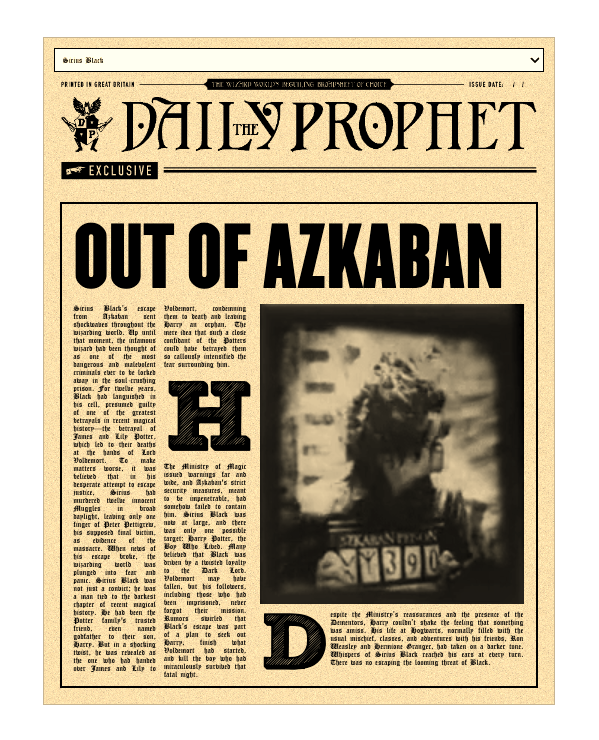

# The Daily Prophet Clone

[Live](https://the-daily-prophet.vercel.app) /
[Repo](https://github.com/manuelsanchez2/the-daily-prophet)

## Key Features

- 🚀 Built with SvelteKit and Svelte 5: Enjoy the latest Svelte 5 capabilities!

- 🎨 Styled with TailwindCSS: Fast, modern styling using Tailwind, fully customizable to match your brand.

- 💻 Server-Side Rendering: Ensures faster load times and improved search engine indexing.

## How to configure

### Setup

You might probably just need to use `npm i`! Apart from that, I always recommend use `nvm use` to use the node lts version (see `.nvmrc`).
